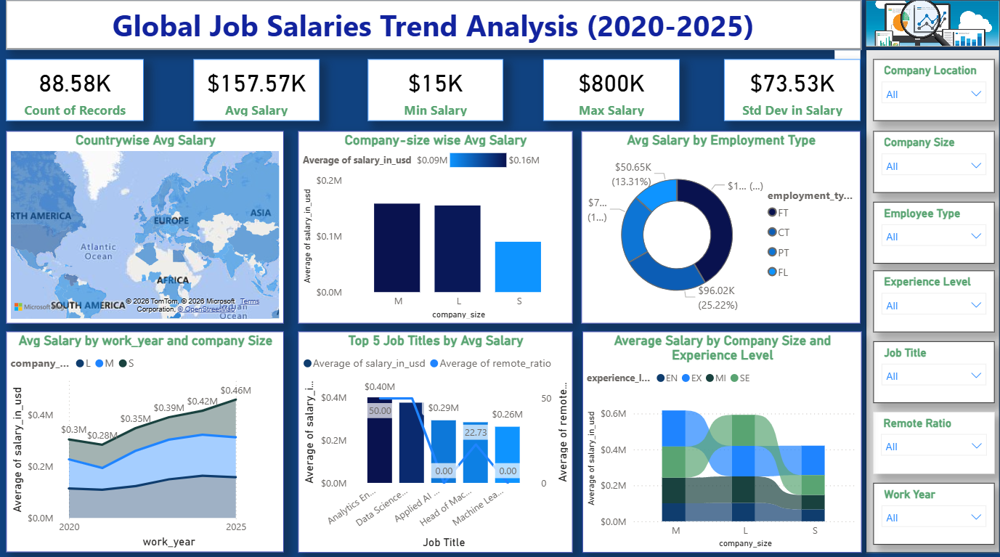

# 🌍 Global Salaries Trend Analysis Dashboard (2020–2025)

## 📌 Project Overview
The **Global Salaries Trend Analysis Dashboard** is an advanced and interactive Power BI project designed to analyze worldwide salary trends from **2020 to 2025** using KPI metrics, dynamic visual analytics, and multi-filter dashboard interactions.

This project helps users explore salary insights across multiple countries, company sizes, experience levels, employment types, remote work categories, and job titles. The dashboard transforms raw salary datasets into meaningful business intelligence using Power BI, DAX calculations, and interactive visualization techniques.

The project focuses on discovering salary patterns, comparing compensation trends, analyzing workforce distribution, and understanding how salaries vary across different global workforce factors.

---

# 🎯 Business Problems Solved
- Identifying countries with the highest average salaries
- Comparing salary distribution across multiple job roles
- Understanding salary trends based on experience levels
- Analyzing how company size affects employee salaries
- Evaluating remote work salary patterns
- Comparing employment types and compensation structures
- Tracking salary growth trends from 2020–2025
- Finding dynamic average salary trends using interactive filters
- Identifying maximum and minimum salary variations
- Exploring salary differences across global workforce categories

---

# 📊 Dashboard Features
✅ Interactive Power BI Dashboard  
✅ Dynamic Multi-Select Slicers  
✅ KPI Cards for Key Metrics  
✅ Country-wise Salary Analysis  
✅ Job Title Salary Comparison  
✅ Company Size Salary Insights  
✅ Experience Level Analysis  
✅ Employment Type Analysis  
✅ Remote Ratio Analysis  
✅ Year-wise Salary Trend Analysis  
✅ Dynamic Cross-Filtering  
✅ Drill-down Analytics  
✅ Interactive Data Exploration  

---

# 📈 Key KPI Metrics
- Total Record Count
- Average Salary
- Minimum Salary
- Maximum Salary
- Standard Deviation in Salary

---

# 🛠️ Technologies Used
- Power BI
- Power Query
- DAX (Data Analysis Expressions)
- CSV Dataset
- Data Cleaning & Transformation
- Interactive Data Visualization

---

# 🧹 Data Cleaning & Transformation
The dataset was cleaned and transformed using Power Query and Power BI techniques:
- Removed duplicate records
- Processed missing and null values
- Structured salary-related fields
- Standardized categorical data
- Improved dataset quality for analysis
- Optimized data for dashboard performance

---

# 📌 DAX Functions Used
- Average Salary Calculation
- Maximum Salary Calculation
- Minimum Salary Calculation
- Record Count Measures
- Standard Deviation Measures
- Dynamic Filtering Functions
- KPI-Based Calculations

---

# 🌎 Dashboard Insights
- Senior-level professionals receive higher salaries globally
- Large companies provide higher average salary packages
- Remote work opportunities increased significantly after 2021
- Salary trends vary across countries and job titles
- Full-time employment dominates the salary distribution
- Dynamic filters help identify salary trends instantly
- Salary growth trends can be tracked year-wise from 2020–2025
- Multiple country selections allow comparative analysis efficiently

---

# 📂 Dataset Information
- Source: Kaggle
- Dataset Format: CSV
- Total Records: 88K+ Rows
- Analysis Period: 2020–2025

---

# 📸 Dashboard Preview

---

# 📁 Repository Contents
- Global Job Salaries Trend Analysis.pbix
- dashboard.png
- salaries.csv
- README.md

---

# ▶️ How to Run This Project
1. Download or clone the repository
2. Open the `.pbix` file using Power BI Desktop
3. Load the dataset if required
4. Use interactive slicers and filters
5. Explore salary insights dynamically

---

# 📊 Results & Findings
- Successfully analyzed global salary trends from 2020–2025
- Identified average salary patterns dynamically
- Found maximum and minimum salary distributions across countries and job roles
- Compared salaries using multiple interactive filters
- Discovered salary differences based on company size and experience levels
- Analyzed employment type and remote work impact on salaries
- Enabled detailed comparative salary analysis across global regions

---

# 📝 Conclusion
This project demonstrates the power of Power BI in transforming raw salary datasets into meaningful business insights through interactive dashboards, DAX calculations, and data visualization techniques.

The dashboard provides an efficient way to analyze global salary patterns and supports data-driven decision-making using dynamic filtering and visual analytics.

---

# 🚀 Future Scope
- Add real-time salary data integration
- Build predictive salary forecasting models
- Add advanced drill-through reports
- Integrate AI-based analytics
- Expand dashboard with additional workforce datasets
- Publish dashboard using Power BI Service

---

# 🚀 Project Development Workflow

## 🔹 Problem Identification
The project was initiated to understand how salaries vary globally across different workforce factors such as job roles, experience levels, company sizes, employment types, and remote work categories between 2020–2025.

The goal was to convert raw salary data into meaningful business insights through interactive analytics and visualization.

---

## 🔹 Data Preparation
- Imported and structured the dataset in Power BI
- Cleaned and transformed raw data using Power Query
- Removed duplicate and unnecessary records
- Handled missing and null values
- Standardized salary-related fields for accurate analysis

---

## 🔹 Analytical Implementation
Implemented DAX calculations and KPI measures for:
- Average Salary
- Maximum Salary
- Minimum Salary
- Record Count
- Standard Deviation
- Dynamic filtering analysis

The dashboard was designed to support interactive and comparative analysis using multi-select slicers and cross-filtering functionality.

---

## 🔹 Dashboard Development
Created an interactive dashboard featuring:
- KPI cards
- Salary trend visualizations
- Country-wise analysis
- Job role comparison
- Company-size insights
- Experience-level analysis
- Remote work distribution
- Dynamic filtering and drill-down analysis

---

## 🔹 Business Impact & Outcomes
- Enabled dynamic salary trend analysis from 2020–2025
- Simplified comparative salary analysis across multiple categories
- Identified salary growth patterns and workforce insights
- Improved analytical reporting and business intelligence understanding
- Demonstrated practical implementation of Power BI, DAX, and data visualization techniques

---

# ⭐ Project Highlights
This project demonstrates:
- Data Cleaning
- Data Transformation
- Data Modeling
- DAX Calculations
- Business Intelligence Reporting
- Dashboard Development
- Analytical Thinking
- Interactive Data Visualization

---

# 👨‍💻 Author
## Abhishek Chaudhari

---

# 📬 Connect With Me

📧 Gmail  
[abhishek02.tech@gmail.com](mailto:abhishek02.tech@gmail.com)

💼 LinkedIn  
[Abhishek Chaudhari](https://www.linkedin.com/)

💻 GitHub  
[abhishekz-tech](https://github.com/abhishekz-tech)
